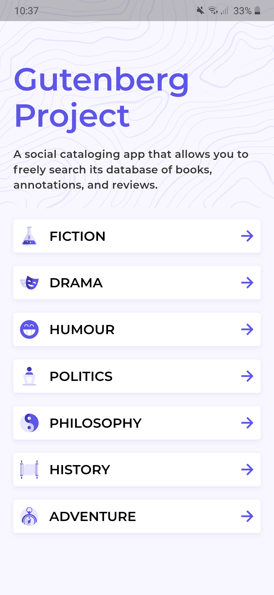
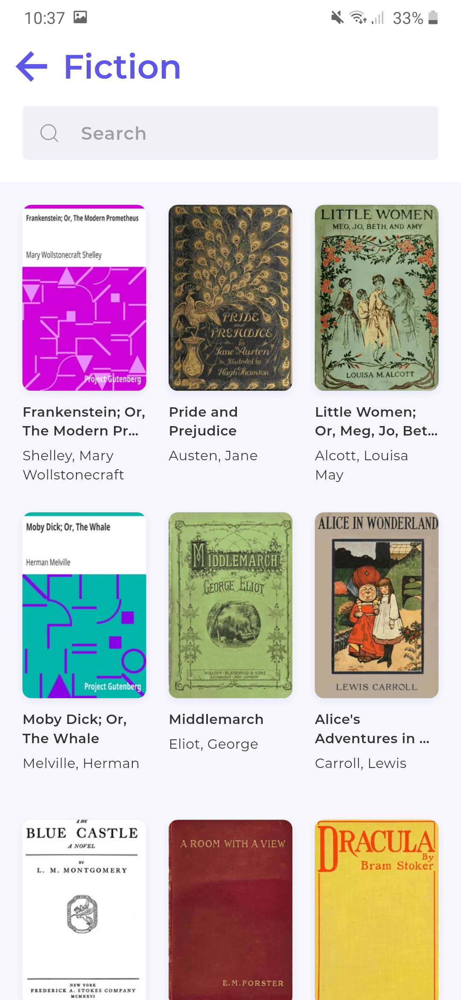
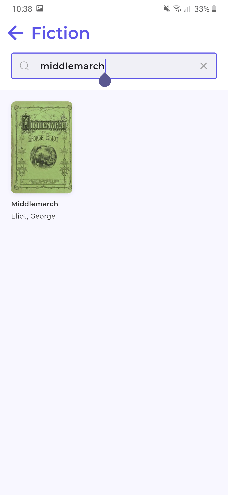
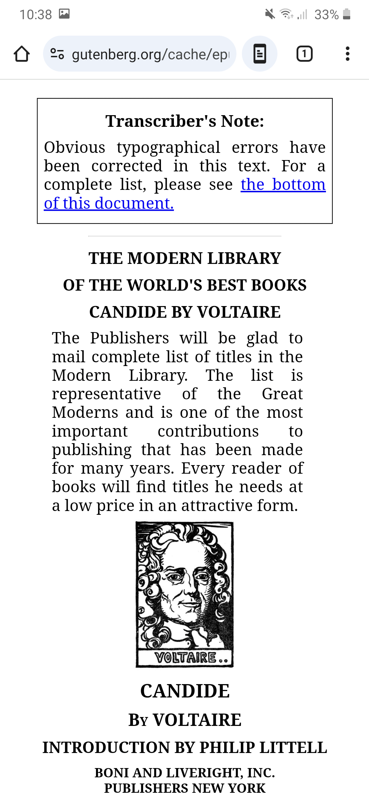

# Gutendex Cross Platform Mobile App

The Gutendex API cross platform demo mobile app showcasing infinite scroll-load books with search feature.

## Features

- Infinite scroll with pagination
- Search filtering
- Genre/category/topic based book filtering
- Responsive grid UI (3-column)
- Opens books in HTML format when available
- Built with `Provider` for state management
- Clean MVVM-ish architecture

## Screenshots

### Home Screen



### Genre Wise Books Grid Screen



### Genre Wise Books Search Grid Screen



### Readable Book Screen



## Requirements

- [Flutter SDK](https://docs.flutter.dev/get-started/install) (v3.10 or higher)
- Android Studio or Xcode (for iOS)
- Git
- Device/emulator

## Installation

**1. Clone the repository**

```
git clone https://github.com/omishah/gutendex_app.git
cd gutendex_app
```

**2. Install packages**

```
flutter pub get
```

**2. Run the app**

```
flutter run
```

## License

This project is licensed under the [MIT License](./LICENSE).
